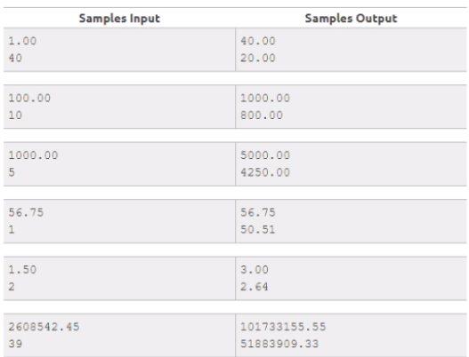

#Proposta da questão

Maria, além de comerciante, é também uma excelente negociante! Por isso, sempre consegue descontos em suas compras. Ao visitar uma loja, Maria recebeu a seguinte proposta de um vendedor: "Se comprar minha mercadoria concederei um desconto fixo de 10% e mais 1% a cada unidade comprada". Infelizmente, Maria está cansada de tanto trabalhar e não quer fazer os cálculos sozinha para descobrir qual será o valor da compra antes e depois do desconto, por isso pediu sua ajuda.

Você criará um programa que receberá como entradas um número real, indicando o preço da mercadoria comprada por Maria, e um número inteiro, indicando a quantidade de mercadoria comprada, e exibirá o valor da compra antes do desconto e o valor final, já com o desconto aplicado.

Observação: Para todos os efeitos, assuma que essa loja nunca vende mais do que 40 unidades de uma mesma mercadoria para a mesma pessoa. Repare que não é necessário verificar, basta assumir que isso é verdade.

##Entrada

Um número real positivo na primeira linha, indicando o preço da mercadoria, e um número inteiro positivo na segunda linha, indicando a quantidade comprada da mercadoria.

##Saída

Na primeira linha deve ser impresso um valor real com duas casas decimais, indicando o preço da compra sem o desconto e, na segunda linha, o preço final com o desconto aplicado, também com duas casas decimais.

###Exemplos para testes

